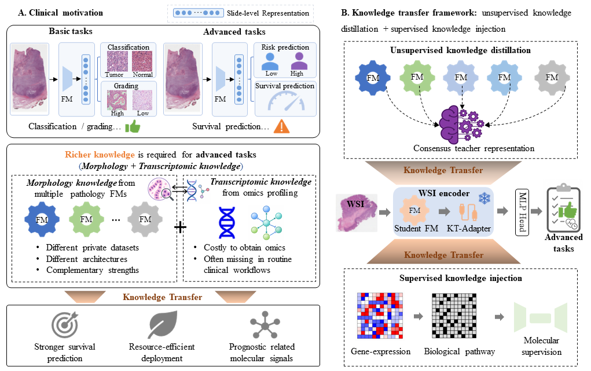

# MOKT: Morphology--Omics Knowledge Transfer

 

- - -

### Dataset
* Training and internal validation: The WSIs used in training and internal validation are from TCGA (https://portal.gdc.cancer.gov/), open access to all. 
* External validation: CPTAC lung cancer dataset.
- - -

### get_DINO_features: Use DINO for patch embedding

* `get_feature.py`：Use the trained DINO for patch embedding.

### patch_clustering: Clustering patches in WSI 

* `featureClustering_dino_8K.py`：Clustering with the features extracted from DINO.
  
* `genFeature_multi_8K.py`：According to the WSI patch clustering results, randomly select patches to build SuRe-Transformer training set.

### Sufficient and Representative Transformer: SuRe-Transformer training

* `splits_k_fold.py`：Make and split training set, validation set and test set for SuRe-Transformer model.

* `train_k_fold_random.py`：Training the SuRe-Transformer model.

*  `test_k_fold_random.py`：Testing the SuRe-Transformer model.

If you have any questions, please contact Haijing Luan at luanhaijing@cnic.cn.
